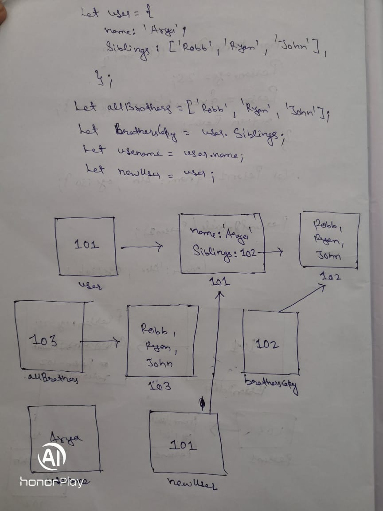

```js
let user = {
  name: 'Arya',
  sibling: ['Robb', 'Ryan', 'John'],
};
let allBrothers = ['Robb', 'Ryan', 'John'];
let brothersCopy = user.sibling;
let usename = user.name;
let newUser = user;
```

1. Memory representation

- Create the memory representation of the above snippet on notebook.
- Take a photo/screenshot and add it to the folder `code`

<!-- To add this image here use  -->

2. Answer the following with reason:

- `user == newUser;` // true because the in the above code `let newUser = user` so the value of user is getting copied by refrence.
- `user === newUser;` // true because the in the above code `let newUser = user` so the value of user is getting copied by refrence.
- `user.name === newUser.name;` // true because `let newUser = user` so the value of user is getting copied by refrence.
- `user.name == newUser.name;` // true because `let newUser = user` so the value of user is getting copied by refrence.
- `user.sibling == newUser.sibling;` // true because `let newUser = user` so the value of user is getting copied by refrence.
- `user.sibling === newUser.sibling;`// true because `let newUser = user` so the value of user is getting copied by refrence.
- `user.sibling == allBrothers;` // false because each object has its own address and both of their address is different.
- `user.sibling === allBrothers;` //  false because each object has its own address and both of their address is different.
- `brothersCopy === allBrothers;` // false because each object has its own address and both of their address is different.
- `brothersCopy == allBrothers;` // false because each object has its own address and both of their address is different.
- `brothersCopy == user.sibling;` //true beause their address is same.
- `brothersCopy === user.sibling;` //true beause their address is same.
- `brothersCopy[0] === user.sibling[0];`//true beause their address is same.
- `brothersCopy[1] === user.sibling[1];` //true beause their address is same.
- `user.sibling[1] === newUser.sibling[1];` //true beause their address is same.
