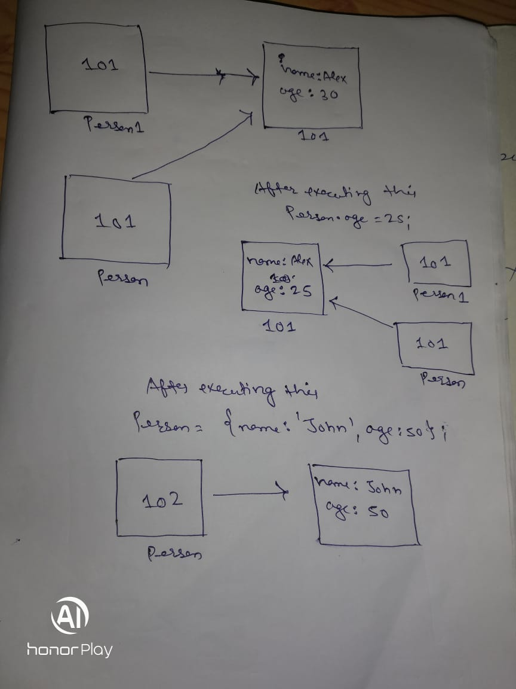

1. What will be the output and explain the reason.

```js
let obj = { name: 'Arya' };
obj = { surname: 'Stark' };
let newObj = { name: 'Arya' };
let user = obj;
let arr = ['Hi'];
let arr2 = arr;
```

Answer the following with reason after going through the above code:

- `[10] === [10]`
- What is the value of obj? // answer
- `obj == newObj` // false because both has different address
- `obj === newObj` // false because both has different address
- `user === newObj` // false because both has different address
- `user == newObj` // false because both has different address
- `user == obj` // true because it is getting copied by refrence
- `arr == arr2` // true because it is getting copied by refrence
- `arr === arr2` // true because it is getting copied by refrence

2. What's will be the value of `person1` and `person2` ? Explain with reason. Draw the memory representation diagram.

<!-- To add this image here use  -->

```js
function personDetails(person) {
  person.age = 25;
  person = { name: 'John', age: 50 };
  return person;
}
var person1 = { name: 'Alex', age: 30 };
var person2 = personDetails(person1);
console.log(person1);
console.log(person2);
```
// person1 = {name: 'Alex', age: 25}
// person2 = {name: 'John', age: 50}
// person1 stored its value in a address after that when the function is called and in the parameters address of person 1 get called and then it get copied to the function personDetails parameters so address of person and person1 is same so after that when ` person.age = 25;` get executed the value of age get changed to 25 and as we know person and person1 share the same address so `console.log(person1);` will be `{name: 'Alex', age: 25}` after that when `person = { name: 'John', age: 50 };` then person address get changed and it stores the value ` person = { name: 'John', age: 50 };` so after that the value and get stored to variable person2.

3. What will be the output of the below code:

```js
var brothers = ['Bran', 'John'];
var user = {
  name: 'Sansa',
};
user.brothers = brothers;
brothers.push('Robb');
console.log(user.brothers === brothers); //1. true
console.log(user.brothers.length === brothers.length); //2. true
```
